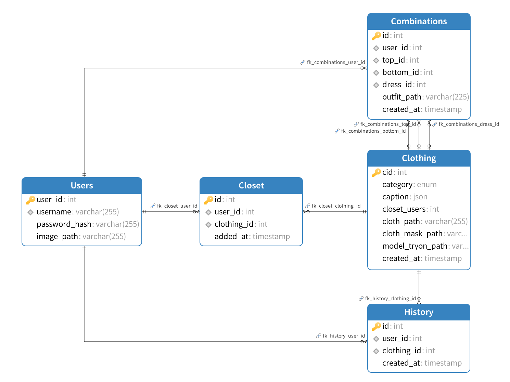

# Code Report

## Table of Contents

- [1. Project Overview](#1-project-overview)
- [2. Technology Stack](#2-technology-stack)
- [3. Project Structure](#3-project-structure)
- [4. Frontend Architecture](#4-frontend-architecture)
- [5. Backend Architecture](#5-backend-architecture)
  - [5.1 Database Configuration](#51-database-configuration)
- [6. API Documentation](#6-api-documentation)
- [7. Database Design](#7-database-design)
- [8. ORM Data Models](#8-orm-data-models)
- [9. Model Integration](#9-model-integration)
- [10. Deployment & Setup](#10-deployment--setup)
- [11. Team Contributions](#11-team-contributions)
- [12. Appendix](#12-appendix)


## 1. Project Overview

**OVDR (Online Virtual Dressing Room)** is a full-stack web application that enables users to virtually try on clothing. It combines user-uploaded full-body images with a selected clothing item to generate a photorealistic try-on result using the StableVITON model. The platform also features intelligent clothing search (powered by CLIP), closet management, and browsing history.

This system aims to improve online fashion shopping experiences through:
- AI-powered virtual try-on
- Text-based outfit search
- Smart closet & history tracking
- Personalized recommendations

This system integrates computer vision, recommendation systems, and text-image matching to support a complete virtual fitting experience. It is suitable for online retail platforms looking to enhance user experience and reduce return rates.

---
### Key Tasks & Deliverables
| Task                                                         | Achivements                                                                 |
|----------------------------------------------------------------------|-----------------------------------------------------------------------------|
| Web-based application with intuitive UI                          | React frontend + Flask backend            |
| Clothing dataset with corresponding text descriptions                | Organized dataset (tops, bottoms, dresses) with auto-generated captions    |
| Functional clothing retrieval and recommendation systems             | CLIP-based similarity search and planned collaborative filtering module    |
| Efficient browsing and try-on with integrated text search            | Connects search → try-on → save/share experience                           |

---


## 2. Technology Stack
- **Frontend**: React.js + CSS
- **Backend**: Flask (RESTful API)
- **Database**: MySQL (with SQLAlchemy ORM)
- **Machine Learning Models**:
  - StableVITON (Try-on generation)
  - CLIP (Text-image matching)
  - Qwen-VL (Clothing caption generation)
- **Other Tools**:
  - Flask-Mail (email delivery)
  - Flask-CORS (cross-origin handling)
  - OpenAI API & Aliyun Dashscope (captioning)
  - dotenv for secret management
  - PIL, Torch, TQDM for image and ML processing

## 3. Project Structure
The OVDR project is organized into the following main folders:

- `backend/`: Flask-based server-side application
- `data/`: All images and user uploads
- `frontend/`: React-based user interface
- `docs/`: Project documentation
- `website/`: Static HTML website of project

---

<details>
<summary>📁 OVDR/ (Root Project)</summary>

```bash
OVDR/
├── app.py                          # Project root entrypoint (if needed)
├── README.md                       # Project overview
├── .gitignore                      # Git ignored files
```
</details>

---

<details>
<summary>📁 backend/ — Flask backend</summary>

```bash
├── backend/                        # Flask backend
│   ├── __init__.py                 # create_app() and app initialization
│   ├── config.py                   # Config class for DB, mail, etc.
│   ├── exts.py                     # db/mail/cors plugin initialization
│   ├── .env                        # Environment variables for secrets
│
│   ├── database/                   # DB schema, data and documentation
│   │   ├── OVDR.sql
│   │   ├── ovdr_structure.sql
│   │   ├── ovdr_data_only.sql
│   │   ├── backup.sql
│   │   ├── ERD.png                 # Database Entity-Relationship Diagram
│   │   └── database.md             # DB documentation
│
│   ├── migrations/                 # Flask-Migrate migration files
│
│   ├── models/                     # Model directories
│   │   ├── clip-vit-large-patch14  # CLIP model
│   │   └── StableVITON/            # StableVITON try-on model
│
│   ├── routes/                     # Flask route blueprints
│   │   ├── __init__.py
│   │   ├── auth.py                 # Login/Register routes
│   │   ├── closet.py               # Clothing listing & closet management
│   │   ├── combination.py          # Outfit combination logic
│   │   ├── email.py                # Email sending routes
│   │   ├── forms.py                # WTForms for validation
│   │   ├── history.py              # Browsing history
│   │   ├── process.py              # Try-on image generation
│   │   ├── recommend.py            # Recommendation system
│   │   ├── search.py               # CLIP-based text search
│   │   └── user_image.py           # User image upload & fetch
│
│   ├── scripts/                    # One-time utility scripts
│   │   ├── image_embedding.py
│   │   ├── insert_clothes_data.py
│   │   ├── precompute_similarity.py
│   │   ├── qwen_generate_caption.py
│   │   ├── recommend_clicktime.py
│   │   ├── recommend_sim_algorithm.py
│   │   ├── rename_clothes.py
│   │   ├── save_CLIP_model.py
│   │   ├── search_algorithm.py
│   │   ├── search_api.py
│   │   └── similarity_matrix.npy
│
│   ├── utils/                      # Utility modules
│   │   ├── caption_utils.py        # Caption formatting and generation
│   │   ├── download_utils.py       # Download cloth image from URL
│   │   ├── helpers.py              # URL/path formatting utilities
│   │   ├── image_utils.py          # Save/rename/delete user images
│   │   ├── stableviton_runner.py   # Run StableVITON subprocess
│   │   ├── static_serve.py         # Static image serving utilities
│   │   ├── config.py               # Duplicate? (backend/config.py used)
│   │   ├── exts.py                 # Duplicate? (used for plugin setup)
│   │   └── models.py               # SQLAlchemy models (User, Clothing...)
│
│   └── similarity_matrix.npy       # Precomputed similarity matrix
```
</details>

---

<details>
<summary>📁 data/ — Static & dynamic image data</summary>

```bash
├── data/                           # Image assets & user uploads
│   ├── clothes/                    # Main clothing image dataset
│   │   ├── tops/
│   │   │   ├── cloth/
│   │   │   ├── cloth-mask/
│   │   │   └── model-tryon/
│   │   ├── bottoms/
│   │   ├── dresses/
│   │   └── captions/               # Generated captions JSONs
│
│   ├── users/
│   │   ├── image/                  # Uploaded user full-body images
│   │     └── 1.jpg                 # Named by user_id
│
│   └── combinations/               # Output try-on images
│       └── user_1/
│           └── 000001.jpg
```
</details>

---

<details>
<summary>📁 frontend/ — React-based frontend</summary>

```bash
├── frontend/                       # React frontend
│   ├── node_modules/               # Frontend dependencies
│   ├── public/
│   ├── src/                        # Main frontend code
│   │   ├── App.js / App.css
│   │   ├── ClothesDetail.js / .css
│   │   ├── FullCloset.js / .css
│   │   ├── History.js / .css
│   │   ├── Home.js / .css
│   │   ├── Login.js / .css
│   │   ├── Register.js
│   │   ├── SendImage.js / .css
│   │   ├── TryOn.js / .css
│   │   ├── UploadImage.js / .css
│   │   ├── index.js / index.css
│   │   └── setupTests.js / reportWebVitals.js
│   ├── package.json                # React project config
│   ├── package-lock.json
│   └── README.md                   # Frontend description
```
</details>

---

<details>
<summary>📁 docs/ — Project documentation</summary>

```bash
├── docs/                           # Project documentation
│   ├── code_report.md              # Final report with structure & logic
│   ├── api_documentation.md        # Full REST API documentation
│   └── Summary_of_quality_assurance.pdf  # Quality testing doc
```
</details>

---

<details>
<summary>📁 website/ — Static information site</summary>

```bash
├── website/                        # Static info website
│   ├── css/
│   ├── minutes/
│   ├── src/
│   └── projectindex.html           # Presentation site
```
</details>

---

## 4. Frontend Architecture
Please refer to JSdoc at https://csprojects.nottingham.edu.cn/grp-team07-gitlab/grp-team07-gitlab-work/-/tree/main/docs/JSdocs


## 5. Backend Architecture
- Each route module encapsulates one set of responsibilities:

  - `user_image.py`: Handle upload/retrieve user photos
  - `closet.py`: Clothing catalog and user closet
  - `process.py`: Virtual try-on (StableVITON)
  - `search.py`: Search with CLIP and text queries
  - `history.py`: User browsing records 
  - `recommend.py`: Related outfit recommendation (optional)

- All static image routing handled by static_serve.py

- Database managed via SQLAlchemy + Flask-Migrate

### 5.1 Database Configuration

The OVDR backend system is powered by a **MySQL-compatible relational database** to store users, clothing metadata, try-on results, and behavioral logs. SQLAlchemy ORM is used for seamless object-relational mapping.

#### Configuration Method

Database credentials and server details are managed through environment variables in a `.env` file located under `./backend/`, loaded via `python-dotenv`. This prevents hardcoding sensitive credentials in source code.


In `backend/config.py`, SQLAlchemy URI is constructed as:
```python
SQLALCHEMY_DATABASE_URI = f"mysql+pymysql://{USER_NAME}:{PASSWORD}@{HOSTNAME}:{PORT}/{DATABASE}?charset=utf8mb4"
```
#### Initial Database Setup
The database schema and sample data are provided under:

- `backend/database/ovdr_structure.sql` – full schema (tables, constraints, types)

- `backend/database/ovdr_data_only.sql` – data-only insert statements

To initialize a local MySQL database:
```bash
mysql -u root -p
CREATE DATABASE ovdr;
USE ovdr;
SOURCE path/to/ovdr_structure.sql;
SOURCE path/to/ovdr_data_only.sql;
```
Once completed, update .env with:
```ini
HOSTNAME=localhost
```
#### Common Development IPs
The following are commonly used IP addresses during internal development:
- `10.176.45.0`: used under eduroam
- `172.19.108.9`: used under UNNC-Living
If your system fails to connect to these, migrate to local MySQL using the above steps.

#### Support
If you encounter access issues, please reach out to the maintainer via email: `ssyzd4@nottingham.edu.cn`.

## 6. API Documentation
This section documents all RESTful APIs for the OVDR system. Each subsection corresponds to one module.

---

### 🔐 1. Authentication API (`routes/auth.py`)
> Manage user login and registration logic

---
#### `POST /login`

**Description**: Authenticate user using username and password.

**Form Data**:
| Field    | Type   | Required | Description             |
|----------|--------|----------|-------------------------|
| username | string | Yes      | The user's username     |
| password | string | Yes      | Plaintext password input|

**Response**:
```json
{
  "success": "Login successful!",
  "username": "testuser",
  "user_id": 1
}
```

**Error Responses**:
- `400 Bad Request` - Username does not exist
- `400 Bad Request` - Password entered incorrectly
- `400 Bad Request` - Invalid input (form validation failed)

---

#### `POST /register`

**Description**: Register a new user with a unique username and encrypted password.

**Form Data**:
| Field    | Type   | Required | Description         |
|----------|--------|----------|---------------------|
| username | string | Yes      | Unique username     |
| password | string | Yes      | Password to encrypt |

**Response**:
```json
{
  "message": "User registration succeeded!"
}
```

**Error Response**:
```json
{
  "error": [["Username already exists."]]
}
```

---

#### `GET /captcha/email`

**Description**: Sends a 4-digit verification code to the provided email address. (To be integrated into registration in future)

**Query Parameters**:
| Name  | Type   | Required | Description            |
|-------|--------|----------|------------------------|
| email | string | Yes      | Email to receive code  |

**Response**:
```text
success
```

---

#### `GET /test`

**Description**: Test email sending (hardcoded email). For development/debugging purposes.

**Response**:
```text
Send successfully
```
---

### 👤 2. User Image API (`routes/user_image.py`)
> Upload or retrieve user full-body photos
#### `POST /upload_image`

**Description**: Upload a user full-body image and update the database with the saved path.

**Form Data**:

| Field    | Type   | Required | Description               |
|----------|--------|----------|---------------------------|
| user_id  | int    | Yes      | ID of the user            |
| file     | file   | Yes      | Image file to be uploaded |

**Response**:
```json
{
  "message": "Image uploaded and path updated successfully",
  "image_path": "data/users/image/1.jpg"
}
```

**Errors**:
- 400: Missing fields or empty file
- 404: User not found

---

#### `GET /get_user_info`

**Description**: Retrieve user profile information including the uploaded image path.

**Query Parameters**:

| Name     | Type | Required | Description       |
|----------|------|----------|-------------------|
| user_id  | int  | Yes      | ID of the user    |

**Response**:
```json
{
  "user_id": 1,
  "username": "alice",
  "image_path": "data/users/image/1.jpg"
}
```

**Errors**:
- 400: Missing user_id
- 404: User not found

---

### 🧥 3. Closet API (`routes/closet.py`)

> Endpoints for browsing and managing virtual clothing closet.

---

#### `GET /api/clothes`

**Description**: Retrieve all clothing items filtered by category.

**Query Parameters**:

| Name     | Type   | Required | Description                                 |
|----------|--------|----------|---------------------------------------------|
| category | string | No       | Clothing category: `tops`, `bottoms`, `dresses` (default: `tops`) |

**Response**:
```json
{
  "message": "Success",
  "items": [
    {
      "id": 1,
      "title": "Red Floral Cotton Blouse with v-neckline and short sleeves",
      "image_path": "http://localhost:5000/data/clothes/tops/model-tryon/00001.jpg",
      "closet_users": 3
    }
  ]
}
```

---

#### `GET /detail/<clothing_id>`

**Description**: Retrieve detailed info about a specific clothing item.

**Path Parameters**:

| Name         | Type | Description         |
|--------------|------|---------------------|
| clothing_id  | int  | Clothing item ID    |

**Response**:
```json
{
  "message": "Success",
  "item": {
    "id": 1,
    "labels": ["red", "floral", "cotton", "blouse"],
    "title": "Red Floral Cotton Blouse with v-neckline and short sleeves",
    "cloth_path": "http://localhost:5000/data/clothes/tops/cloth/00001.jpg"
  }
}
```

---

#### `POST /add-to-closet`

**Description**: Add a clothing item to a user's closet.

**Request Body**:
```json
{
  "user_id": 1,
  "clothing_id": 5
}
```

**Constraints**:
- A user can have **up to 5 items per category**.
- Duplicate additions are not allowed.

**Success Response**:
```json
{
  "message": "Item added to closet successfully!"
}
```

**Error Responses**:
```json
{
  "error": "Item already in closet!"
}
```
```json
{
  "error": "Max 5 tops items allowed. Remove one to add new."
}
```

---

#### `GET /get-closet`

**Description**: Get all clothing items in a user's closet, optionally filtered by category.

**Query Parameters**:

| Name     | Type   | Required | Description                        |
|----------|--------|----------|------------------------------------|
| user_id  | int    | Yes      | ID of the user                    |
| category | string | No       | Category to filter (default: tops) |

**Response**:
```json
{
  "message": "Success",
  "closet": [
    {
      "id": 5,
      "category": "tops",
      "url": "http://localhost:5000/data/clothes/tops/cloth/00005.jpg"
    }
  ]
}
```

---

#### `POST /remove-from-closet`

**Description**: Remove a clothing item from a user's closet.

**Request Body**:
```json
{
  "user_id": 1,
  "clothing_id": 5
}
```

**Response**:
```json
{
  "message": "Item removed from closet successfully."
}
```

---

#### `GET /data/clothes/<path:filename>`

**Description**: Serve static clothing images from the `/data/clothes/` directory.

**Example Request**:
```
GET /data/clothes/tops/model-tryon/00001.jpg
```

**Response**:
- Returns the image directly if found.
- HTTP 404 if the image is missing.
---

### 🕘 4. History API (`routes/history.py`)
> Track and retrieve browsing history

#### `POST /add-history`

**Description**:  
Adds a clothing item to the user's browsing history.  
- Prevents duplicate entries.
- Keeps only the latest 20 records per user.

**Request Body** (JSON):
```json
{
  "user_id": 1,
  "clothing_id": 5
}
```

**Response**:
```json
{
  "message": "History recorded successfully."
}
```

**Errors**:
- `400`: Missing `user_id` or `clothing_id`.
- `500`: Database error or insertion failure.

---

#### `GET /get-history`

**Description**:  
Retrieves the latest 20 items viewed by a specific user from their browsing history.

**Query Parameters**:

| Name     | Type | Required | Description       |
|----------|------|----------|-------------------|
| user_id  | int  | Yes      | ID of the user    |

**Example Request**:
```
GET /get-history?user_id=1
```

**Response**:
```json
{
  "message": "Success",
  "history": [
    {
      "id": 5,
      "image": "http://localhost:5000/data/clothes/tops/cloth/00005_top.jpg",
      "title": "Red Floral Cotton Blouse with round neckline and long sleeves",
      "created_at": "2024-03-30 14:23:12",
      "closet_users": 7,
      "category": "tops"
    }
  ]
}
```

**Errors**:
- `400`: Missing `user_id`.
- `500`: Database error or malformed caption field.

---

### ✨ 5. Try-On API (`routes/process.py`)
> Generate virtual try-on results
---

#### `POST /process_image`

**Description**:  
Generate a virtual try-on image by combining a user-uploaded full-body image and a selected clothing item.

You can either:
- Provide `item_id` (recommended): automatically fetch clothing from database.
- OR provide `cloth_url` directly (e.g., from frontend image selection).

**Request Body (JSON)**:

| Field         | Type   | Required | Description                                                              |
|---------------|--------|----------|--------------------------------------------------------------------------|
| user_id       | int    | ✅ Yes   | ID of the user                                                           |
| item_id       | int    | ❌ No    | Closet item ID to fetch clothing from DB                                 |
| cloth_url     | string | ❌ No    | Optional: URL or path to clothing image                                  |
| item_category | string | ✅ Yes   | Type of clothing: "tops", "bottoms", or "dresses"                        |

> ⚠️ Either `item_id` or `cloth_url` must be provided.

**Example**:

```json
{
  "user_id": 1,
  "item_id": 15,
  "item_category": "tops"
}
```

**Success Response**:

```json
{
  "message": "success",
  "image_path": "0000012.jpg"
}
```

**Error Responses**:

- `400 Bad Request`: Missing required fields or image
- `404 Not Found`: User or image not found
- `500 Internal Server Error`: StableVITON failure or file I/O issues

---

#### `GET /data/clothes/<filename>`

**Description**:  
Serve static clothing images from the `/data/clothes/` directory.

**Example**:  
Request: `GET /data/clothes/tops/cloth/000001_top.jpg`

Returns: Clothing image file.

---

### 🔍 6. Search API (`routes/search.py`)
> Text-based clothing search  
--- 
#### `GET /search`

**Description**:  
Search for clothing items using a natural language text query. The backend uses a pretrained CLIP model to match text to clothing image embeddings.

**Query Parameters**:

| Name     | Type   | Required | Description                                     |
|----------|--------|----------|-------------------------------------------------|
| query    | string | ✅ Yes   | Natural language query (e.g. "red hoodie")      |
| top_n    | int    | ❌ No    | Number of results to return (default: 20)       |

**Response**:
Returns an array of matched clothing items ranked by similarity.

```json
{
  "items": [
    {
      "id": 12,
      "title": "Red Cotton Hoodie",
      "category": "tops",
      "image_path": "http://localhost:5000/data/clothes/tops/cloth/00012_top.jpg",
      "closet_users": 3
    },
    ...
  ]
}
```

**Errors**:

| Code | Description                               |
|------|-------------------------------------------|
| 400  | Missing query parameter                   |
| 500  | Internal error (model failure, DB error)  |

---


### 🎯 7. Recommendation API (`routes/recommend.py`)
> Recommend popular items or personalized content  
--- 
#### `GET /clothing/{id}`
- **Description:** Retrieve clothing details
- **Response:**
```json
{
  "id": 1,
  "name": "White Blouse",
  "category": "tops"
}
```

#### `GET /recommend/{clothing_id} `
- **Description:** Retrieve top visually and semantically similar clothing items.
- **Response:**
```json
{
  "recommendations": [
    {
      "id": 12,
      "url": "http://localhost:5000/data/clothes/tops/000045_top.jpg"
    }
  ]
}
```

#### `GET /recommend/popular`
- **Description:** Retrieve globally popular clothing items based on interaction frequency.
- **Response:**
```json
{
  "recommended_popular": [
    {
      "id": 88,
      "category": "bottoms",
      "url": "http://localhost:5000/data/clothes/bottoms/000088_bottom.jpg"
    }
  ]
}
```

#### `GET /recommend/user/{user_id}`
- **Description:** Recommend clothing items for a user based on collaborative filtering.
- **Response:**
```json
{
  "personalized_recommendations": [
    {
      "id": 73,
      "category": "dresses",
      "url": "http://localhost:5000/data/clothes/dresses/000073_dress.jpg"
    }
  ]
}
```

---

### 🧵 8. Combination API (`routes/combination.py`)
> Save try-on results and show outfit combinations 

#### `POST /save-combination`

**Description**: Save a virtual try-on combination to the database.

**Request Body (JSON)**:

| Field        | Type   | Required | Description                                 |
|--------------|--------|----------|---------------------------------------------|
| user_id      | int    | ✅ Yes   | ID of the user                              |
| top_id       | int    | ❌ No    | ID of the top clothing item                 |
| bottom_id    | int    | ❌ No    | ID of the bottom clothing item              |
| dress_id     | int    | ❌ No    | ID of the dress item                        |
| resultImage  | string | ✅ Yes   | Relative path to the generated try-on image |

**Response Example**:

```json
{
  "message": "Combination saved!"
}
```

---

#### `GET /get-combinations`

**Description**: Retrieve all saved try-on combinations for a given user.

**Query Parameters**:

| Name     | Type | Required | Description       |
|----------|------|----------|-------------------|
| user_id  | int  | ✅ Yes   | ID of the user    |

**Response Example**:

```json
{
  "message": "Success",
  "combinations": [
    {
      "id": 12,
      "top_id": 3,
      "bottom_id": 5,
      "dress_id": null,
      "url": "data/combinations/user_1/000023.jpg"
    }
  ]
}
```
---
#### `DELETE /delete-combination`

**Description**:  
Delete a previously saved outfit combination by its ID.

**Request Body**:
```json
{
  "id": 12
}
```

| Field | Type | Required | Description |
|-------|------|----------|-------------|
| id    | int  | ✅ Yes   | The ID of the combination to delete |

**Response (Success)**:
```json
{
  "message": "Combination deleted successfully."
}
```

**Error Responses**:
- `400 Bad Request`:  
  ```json
  { "error": "Missing combination ID" }
  ```

- `404 Not Found`:  
  ```json
  { "error": "Combination not found" }
  ```

- `500 Internal Server Error`:  
  ```json
  { "error": "Database error or deletion failed" }
  ```

---

#### `GET /show_image/<userid>/<filename>`

**Description**: Serve generated outfit image from the `/data/combinations/user_<userid>/` folder.

**Path Parameters**:

| Name     | Type   | Description                                |
|----------|--------|--------------------------------------------|
| userid   | int    | User ID, used to locate the user directory |
| filename | string | File name of the image (URL-encoded if needed) |

**Example**:
```
GET /show_image/1/000003.jpg
```

Returns: The image file if found.

---

### 📩 9. Email API (`routes/email.py`)

#### `POST /send-email`

**Description**:  
Send a try-on result image to a specified email address. This endpoint expects a base64-encoded image (JPEG) and recipient email.

**Request Body**:
```json
{
  "email": "user@example.com",
  "imageBase64": "data:image/jpeg;base64,/9j/4AAQSkZJRgABAQAAAQABAAD..."
}
```

**Response**:
- On success:
```json
{
  "success": true,
  "message": "Email sent successfully!"
}
```

- On error:
```json
{
  "success": false,
  "message": "Missing email or image"
}
```

**Notes**:
- Make sure your Flask app is configured with SMTP credentials:
  ```python
  MAIL_SERVER = "smtp.qq.com"
  MAIL_PORT = 465
  MAIL_USERNAME = "your_email@qq.com"
  MAIL_PASSWORD = "your_app_password"
  MAIL_USE_SSL = True
  ```

- You must initialize Flask-Mail and register `email_bp` in `create_app()`.


## 7. Database Design

### Overview
The **OVDR** (Online Virtual Dressing Room) database is designed to store user information, virtual try-on data, and clothing items. It supports features like:
- User information (user name, hash password and full body image)
- Clothing item storage with corresponding text descriptions (captions)
- Virtual try-on outfit combinations
- User wardrobe (Closet) management
- History tracking

---

### Database Schema
The following tables are included in the **OVDR** database (obsolete or temporarily unused tables are not included):

### **1. `users` (User Table)**
Stores user credentials and profile data.

| Column         | Type              | Constraints                      | Description                          |
|---------------|------------------|---------------------------------|--------------------------------------|
| `user_id`     | INT (PK, AUTO_INCREMENT) | Primary key | Unique ID for each user |
| `username`    | VARCHAR(255)      | UNIQUE, NOT NULL               | Unique username for login |
| `password_hash` | VARCHAR(255)     | NOT NULL                        | Hashed password |
| `image_path`  | VARCHAR(255)      | DEFAULT NULL                    | Path to user's full-body image |

---

### **2. `clothing` (Clothing Items)**
Stores clothing data and AI-generated descriptions.

| Column         | Type              | Constraints                      | Description |
|---------------|------------------|---------------------------------|-------------|
| `cid`        | INT (PK, AUTO_INCREMENT) | Primary key | Unique clothing item ID |
| `category`   | ENUM('tops', 'bottoms', 'dresses') | NOT NULL | Clothing category |
| `caption`    | JSON | NULL | AI-generated clothing description |
| `closet_users` | INT | DEFAULT 0 | Number of users who added this to wardrobe |
| `cloth_path` | VARCHAR(255) | NOT NULL | Path to clothing image |

---

### **3. `closet` (User Wardrobe)**
Tracks clothing items added to users' wardrobes.

| Column       | Type   | Constraints | Description |
|-------------|--------|-------------|-------------|
| `id`        | INT (PK, AUTO_INCREMENT) | Primary key | Record ID |
| `user_id`   | INT   | NOT NULL, FK → `users(user_id)` | User who owns this wardrobe |
| `clothing_id` | INT | NOT NULL, FK → `clothing(cid)` ON DELETE CASCADE | Clothing item |

#### **Trigger: Limit closet items to 5 per category**
```sql
DELIMITER //
CREATE TRIGGER limit_closet_items
AFTER INSERT ON Closet
FOR EACH ROW
BEGIN
    DELETE FROM Closet
    WHERE user_id = NEW.user_id
    AND id NOT IN (
        SELECT id FROM (
            SELECT id FROM Closet
            WHERE user_id = NEW.user_id
            ORDER BY added_at DESC
            LIMIT 5
        ) AS temp_table
    );
END;
//
DELIMITER ;
```

---

### **4. `history` (User View History)**
Tracks which clothing items users have viewed.

| Column       | Type   | Constraints | Description |
|-------------|--------|-------------|-------------|
| `id`        | INT (PK, AUTO_INCREMENT) | Primary key | Record ID |
| `user_id`   | INT   | NOT NULL, FK → `users(user_id)` | User who viewed clothing |
| `clothing_id` | INT | NOT NULL, FK → `clothing(cid)` ON DELETE CASCADE | Clothing item |
| `created_at` | TIMESTAMP | DEFAULT CURRENT_TIMESTAMP | Timestamp of viewing |

#### **Trigger: Automatically keep only the latest 20 records**
```sql
DELIMITER //
CREATE TRIGGER limit_history_records
AFTER INSERT ON `history`
FOR EACH ROW
BEGIN
    DELETE FROM `history`
    WHERE user_id = NEW.user_id
    AND id NOT IN (
        SELECT id FROM (
            SELECT id FROM history
            WHERE user_id = NEW.user_id
            ORDER BY created_at DESC
            LIMIT 20
        ) AS temp_table
    );
END;
//
DELIMITER ;
```

---

### **Entity Relationship Diagram (ERD)**
---



---
## 8. ORM Data Models
> `./backend/models.py`

This project uses SQLAlchemy ORM to manage database tables. Below is a summary of the key models used in the system.
---
### 3.2.1 `User` Table

| Field       | Type     | Constraints           | Description                       |
|-------------|----------|------------------------|-----------------------------------|
| user_id     | Integer  | Primary Key           | Unique user ID                    |
| username    | String   | Not Null, Unique      | Username for login                |
| password    | String   | Not Null              | Hashed password                   |
| image_path  | String   | Nullable              | Path to uploaded full-body image  |

---

### 3.2.2 `Clothing` Table

| Field            | Type     | Constraints           | Description                            |
|------------------|----------|------------------------|----------------------------------------|
| cid              | Integer  | Primary Key           | Clothing item ID                       |
| category         | Enum     | Not Null              | 'tops', 'bottoms', or 'dresses'        |
| caption          | JSON     | Nullable              | Structured description of the item     |
| closet_users     | Integer  | Default 0             | Number of users who added this to closet |
| cloth_path       | String   | Nullable              | Flat cloth image path                  |
| cloth_mask_path  | String   | Nullable              | Binary mask path                       |
| model_tryon_path | String   | Nullable              | Model try-on image path                |

---

### 3.2.3 `Closet` Table

| Field        | Type     | Constraints           | Description                    |
|--------------|----------|------------------------|--------------------------------|
| id           | Integer  | Primary Key           | Closet entry ID                |
| user_id      | Integer  | Foreign Key (User)    | Owner of this closet item      |
| clothing_id  | Integer  | Foreign Key (Clothing)| Clothing item stored           |
| added_at     | TIMESTAMP| Auto Timestamp        | Time added to closet           |

---

### 3.2.4 `Combination` Table

| Field        | Type     | Constraints              | Description                          |
|--------------|----------|---------------------------|--------------------------------------|
| id           | Integer  | Primary Key              | Combination record ID                |
| user_id      | Integer  | Foreign Key (User)       | User who created this outfit         |
| top_id       | Integer  | FK (Clothing, Nullable)  | Top clothing item                    |
| bottom_id    | Integer  | FK (Clothing, Nullable)  | Bottom clothing item                 |
| dress_id     | Integer  | FK (Clothing, Nullable)  | Dress clothing item                  |
| outfit_path  | String   | Not Null                 | Path to generated try-on image       |
| created_at   | TIMESTAMP| Auto Timestamp           | Creation time                        |

---

### 3.2.5 `History` Table

| Field        | Type     | Constraints              | Description                          |
|--------------|----------|---------------------------|--------------------------------------|
| id           | Integer  | Primary Key              | History record ID                    |
| user_id      | Integer  | Foreign Key (User)       | User who viewed the item             |
| clothing_id  | Integer  | Foreign Key (Clothing)   | Clothing item that was viewed        |
| created_at   | TIMESTAMP| Auto Timestamp           | Time of browsing                     |

---

## 9. Model Integration
- **StableVITON**: Generates try-on results using user photo + garment mask + layout

  - Input: Absolute paths

  - Output: Saved to data/combinations/user_<id>/

- **CLIP (OpenAI)**: Used for text-to-image similarity in search.py

  - Text queries → CLIP text embedding

  - Compared against precomputed image_embeddings.npy

## 10. Deployment & Setup
- **Backend**: Flask on port `5000`
- **Frontend**: React on port  `3000`
- Dev run command:
```bash
cd frontend
npm install -g concurrently
npm run dev  # Starts both backend and frontend
```
- Models stored in `./backend/models/` directory
- Precompute `image_embeddings.npy` for fast search

## 11. Team Contributions

This section outlines both the overall system components and the specific responsibilities undertaken by each team member during development.

### System Components Developed
#### Backend Architecture
- Flask backend initialization (`create_app`)
- Blueprint registration
- Environment-based config management (`config.py`)
- Database connection and migration with SQLAlchemy + Flask-Migrate
- Static file serving for user and clothing images

#### 👤 User Management
- User registration/login APIs with password hashing
- Form validation with WTForms
- Session and user info handling
- User image upload & retrieval logic

#### 🧥 Closet Module
- Clothing item listing by category
- Clothing detail view (with AI-generated captions)
- Add/Remove from virtual closet
- Closet limitations and constraints

#### 📖 Browsing History
- Add history (avoid duplicates, keep last 20)
- Retrieve recent viewed items with full details

#### 🧠 Caption Generation
- Integration with Qwen-VL and ChatGPT for captioning
- JSON-structured output per clothing category
- Fallback support for DeepSeek (deprecated)
- Caption formatting for frontend use

#### 🔍 Search Module (CLIP)
- Load CLIP model and image embeddings
- Text query embedding and similarity scoring
- Search result ranking and image linking

#### ✨ Virtual Try-On (StableVITON)
- Integration of StableVITON with try-on logic
- Handle image inputs, category selection
- Output saving and renaming
- Serve try-on result as image

#### 🧵 Combination Management
- Save and retrieve try-on combinations
- Serve combination images

#### 📩 Email Module
- Send try-on image via email (Base64 decoding)
- SMTP configuration and exception handling

---

### 👥 Individual Responsibilities


| Team Member       | Responsibilities                                                                 |
|-------------------|----------------------------------------------------------------------------------|
| **Zixin Ding**            | Backend architecture, dataset and database, caption generation, user auth, upload, closet and history logic, frontend improvement,  bug fixing, Code Report, README, Installation Manual, Final Report  |
| **Zhihao Cao**     | StableVITON try-on module, image I/O handling, bug fixing, Installation Manual, Final Report|
| **Peini She**      | React frontend development, combination and email routing, bug fixing, User Manual writing|
| **Jinghao Liu** & **Zihan Zhou**    | Search and Reccomendation module with CLIP, embedding logic, semantic search, Quality Assurance |
---


## 12. Appendix
- Sample SQL schema: `./backend/database/OVDR.sql`

- Sample try-on output: `data/combinations/user_1/*.jpg`


